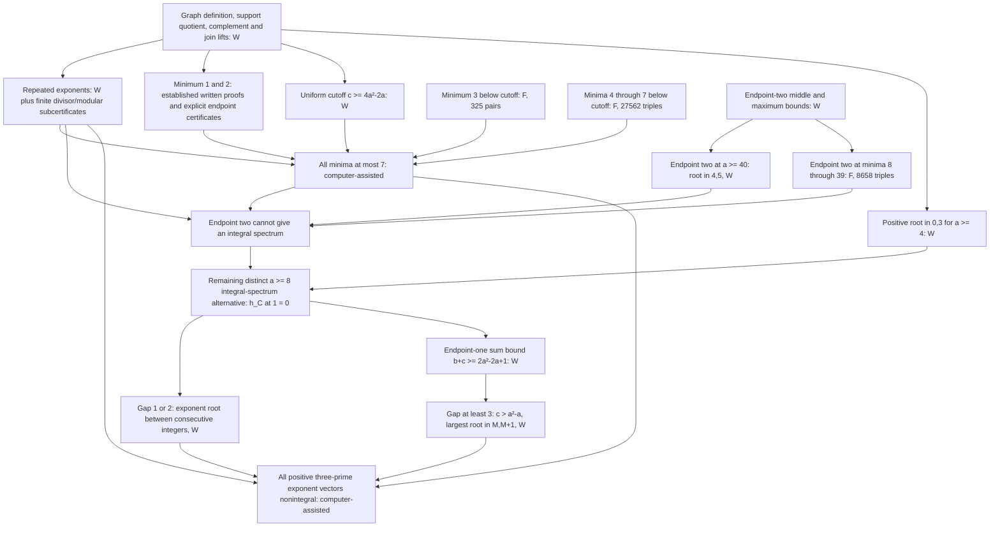

# Structural verification of the three-prime classification

This note supplies the five structural checks requested in PR9. The
classification is Theorem 16.3 in manuscript revision
aeb190caaa6a1dda8ef4e4275bc38b2171ac4081. Its unbounded largest-root and
small-gap steps are Theorem 16.1 and Lemma 16.2. The complete classification
retains finite certificate dependencies.

## 1. Dependency chain

In the diagram, W means a written argument on its stated unbounded domain;
F means an explicit finite certificate. All paths use the support quotient,
its symmetric similarity, the complement reflection, and the integer
universal-vertex shift. They are statements about this ideal intersection
graph; they do not use the separate binary orthogonality project.



The final split is exhaustive: sort a<=b<=c; repeated entries use R,
minimum at most seven uses S7, and otherwise a>=8 and a<b<c. The uniform
low-root theorem forces an integer positive quotient root to be 1 or 2.
The endpoint-two theorem rules out an integral spectrum if 2 is a root.
If 1 is a root, the small-gap lemma handles b-a=1,2; for b-a>=3 the sum
bound and c>=b give c>a²-a, so the largest-root theorem applies.

The principal sources are [repeated exponents](repeated-exponent-completion.md),
[minimum one](one-unit-exponent.md), [minimum two](minimum-two.md),
[cutoff and minimum three](distinct-tail.md),
[minimum through seven](open-region-diagnostic.md),
[uniform low root](mixed-inertia.md),
[endpoint-two middle bound](endpoint-two-middle-tail.md),
[endpoint-two maximum bound](endpoint-two-sharp-maximum.md),
[endpoint-two completion](endpoint-two-completion.md),
[endpoint-one sum bound](endpoint-one-minimum-root.md), and
[largest-root and final classification](largest-root-unit-interval.md).
Earlier repeated-exponent divisor/modular subcertificates, minimum-three
325-pair data, and the explicit small-minimum endpoint checks remain in
the dependency chain. The two large bases are not its only finite inputs.
The 108-pair minimum-eight certificate, equality-curve arithmetic,
smallest-quartic integer splitting, and parity-specific endpoint-one
refinements are unnecessary for this final route.

## 2. Fresh rerun of the two large bases

A new temporary source directory was populated by `git archive` at
b50c6ae3a364c548d296bce774b68e7201c905b5. A new virtual environment without
system site packages used Python 3.14.4, SymPy 1.14.0 and mpmath 1.3.0.
All four commands in the [rerun receipt](../results/three-prime-fresh-base-rerun.json)
completed successfully. No checker source or domain was changed.

The small-minimum generator recomputed all 27,562 quintic discriminants.
Its separate checker then recomputed every discriminant as an integer
9-by-9 Sylvester determinant using fraction-free Bareiss elimination,
checking exact division and strict consecutive-square bounds. The newly
generated CSV was used by that independent checker.

The endpoint-two checker recomputed all 8,658 cubic Horner values and all
8,658 independent integer 6-by-6 Bareiss determinants, with determinant
equal to twice the nonzero Horner value in every row. Its JSON output also
rechecks the written-tail positive coefficient identities and fixed fixtures.

Both regenerated CSV files and both corresponding validation JSON files
are byte-identical to their historical counterparts. Their output hashes are:

| Output | SHA-256 |
|---|---|
| 27,562-triple CSV | `64b2173e944761a31ff8e51cbdb9634a3c545d5cf189f153c3c97580c5af9ecb` |
| Independent small-minimum verification JSON | `95f36c818a9f30ca933c793f159f89db24654c81d86b80472db1858c4dbbd301` |
| 8,658-triple CSV | `6f697abf299366f646b580c54152e53b78c48de1b375fe20682f452abd5f8a70` |
| Endpoint-two completion JSON | `f502a70e41fd8f35a452b10b05cf66e2fafca5db5e8bbef3037725a60af5d0bf` |

This requested fresh rerun is separate from the earlier saved-evidence
coverage audit, which did not recompute these historical quantities.
The smaller earlier subcertificates listed above were not rerun here.

## 3. Independently computed five-term extracts

Use a=3+m, b=a+3+u, c=a²-a+v and M=bc+a+b+c. The standard-library
[independent verifier](../scripts/verify_three_prime_completion.py) builds
the support matrix and computes each determinant in the integer polynomial
ring. Exact polynomial division then recovers

```text
T = det(MI-C)/(-M a²bc),
P = det((M+1)I-C)/(M+1).
```

These extracts are obtained from the reconstructed determinants, rather
than copied out of the saved table. Each quotient agrees coefficientwise
with its entire saved positive expansion. Here are five coefficients of
each polynomial; the table is an extract, not an assertion that the
remaining terms vanish.

| Monomial | T, 36 terms total | P, 170 terms total |
|---|---:|---:|
| 1 | 1404 | 513220 |
| m | 3042 | 2023568 |
| m² | 2517 | 3509410 |
| u | 603 | 461006 |
| v | 603 | 461006 |

## 4. Explicit small-gap cubic-root uniqueness argument

For real a>=8 and b=a+d, d=1 or 2, define Q(c)=h_C(1). Direct expansion
of the six-support quotient gives Q(c)=Ac³+Bc²+Dc+E, with

```text
A=a²+b²-1,
B=a³-4a²b²+2a²b-a²+2ab²+ab-3a+b³-b²-3b+3,
D=(a-1)(b-1)(2ab+3a+3b-3),
E=(a-1)(b-1)(a+b-1)(ab+a+b-1).
```

In particular A>0 and Q(0)=E>0. Put L_1=2a²-a-2 and
L_2=2a²+a-6. The direct determinant identities give

```text
Q(b)<0,  Q(L_d)<0<Q(L_d+1).
```

For example the lower and upper identities are

```text
-Q(L_1)=4a(a+1)(a⁴-4a²-2a+6),
 Q(L_1+1)=4a(a-1)(a+1)(a³-a²+1),
-Q(L_2)=16a⁵+72a⁴-76a³-433a²+69a+595,
 Q(L_2+1)=4(a+2)(2a⁵-2a⁴-17a³+25a²+28a-42).
```

Each expression on the right has strictly positive coefficients after
a=8+m, m>=0. The same positive-coefficient test proves -Q(b)>0;
its ascending m coefficient vectors are

```text
d=1: [1110016,834048,259904,43000,3984,196,4],
d=2: [1734483,1216821,352937,54220,4656,212,4].
```

all six complete vectors are independently verified in the
[audit report](../results/three-prime-independent-audit.json).
Also L_1-b=2a²-2a-3>0 and L_2-b=2a²-8>0.

Since A>0, Q(c) tends to negative infinity as c tends to negative
infinity. The intermediate value theorem therefore gives a root in
each of the three disjoint intervals

```text
(-infinity,0), (0,b), (L_d,L_d+1).
```

A cubic has at most three distinct roots. These three sign-changing
intervals exhaust its roots, each with multiplicity one, so there is
exactly one root above b and it lies strictly between L_d and L_d+1.
For integer a the two endpoints are consecutive integers. Thus no
integer c>b can satisfy Q(c)=0. This proof needs no appeal to an
Appendix, spectral multiplicity claim or finite exponent base.

## 5. Where the anchor is an integer

The largest-root inequality is a real theorem on
3<=a<=b<=c, b-a>=3, c>=a²-a. It does not require M to be an integer.
The nonintegrality consequence applies the theorem to positive integer
exponents: then M=bc+a+b+c is an integer because sums and products of
integers are integers. Therefore (M,M+1) contains no integer eigenvalue.

In the final endpoint-one branch, a>=8 and a<b<c are integers,
b-a>=3, and b+c>=2a²-2a+1. Since b<=c, this implies
2c>=2a²-2a+1, hence c>a²-a, so every hypothesis is met and the anchor
is integral throughout that branch. A real exponent triple may have a
noninteger anchor; only the interval inequality is asserted there.
The complement reflection and universal shift are integral for integer
exponents and preserve nonintegrality.

The full nonsquarefree higher-prime Q3 remains open. Integer endpoint-one
and equality exponent points have not been enumerated or declared absent.
No Lean verification, submission decision or authorship change is claimed.
